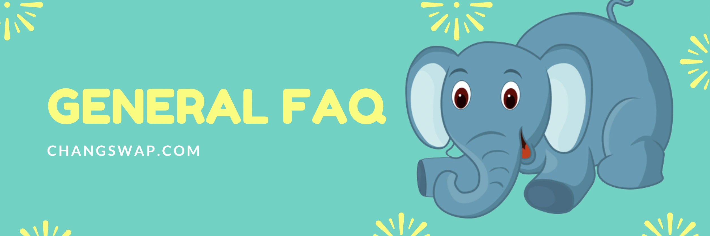

# คำถามที่พบบ่อยทั่วไป

หน้าคำถามที่พบบ่อยนี้จะตอบคำถามที่พบบ่อยบางส่วนจากชุมชน ChangSwap

## ChangSwap ปลอดภัยหรือไม่? ChangSwap ได้รับการตรวจสอบแล้วหรือไม่?

ดูด้วยตัวคุณเอง:

* โปร่งใส:
  * เราสร้างขึ้นจากซอฟต์แวร์โอเพนซอร์ซ: ไซต์ของเราและสัญญาอัจฉริยะทั้งหมดของเราจะปรากฏต่อสาธารณะเพื่อความโปร่งใสสูงสุด
  * สัญญาของเราได้รับการยืนยันบน BkcScan เพื่อให้คุณรู้ว่าสิ่งที่คุณเห็นคือสิ่งที่คุณได้รับ: [1](https://bkcscan.com/address/0x10ED43C718714eb63d5aA57B78B54704E256024E) [2](https://bkcscan.com/address/0x73feaa1e33514f4234017c655 #code) [3](https://bkcscan.com/address/0xbcfccbde45ce874adcb698cc183debcf17952812) [4](https://bkcscan.com/address/0x1b96b92314c44b159149f7e0303511fb2fc4774f#codekcdressscan) [5](https://https://https://https://bkcscan.com/address/0xbcfccbde45ce874adcb698cc183debcf17952812) /0x92E8CeB7eAeD69fB6E4d9dA43F605D2610214E68)
* แนวทางปฏิบัติด้านความปลอดภัยที่ดีที่สุด:
  * เชฟใช้ multisig สำหรับสัญญาทั้งหมด
  * การล็อกเวลาของสัญญาของเราช่วยให้คุณสบายใจ

## ฉันจะเดิมพันช้างได้อย่างไร?

คุณสามารถเดิมพัน CHANG ของคุณใน ChangSwap Brewery Pools ไปที่ [หน้าโรงเบียร์](https://changswap.com/pools)

อ่าน [คู่มือวิธีการเดิมพันในโรงเบียร์](https://docs.changswap.com/products/brewery-pool/brewery-pool-guide) ของเรา หากคุณต้องการเริ่มต้นการปักหลัก

## การปักหลักกับการทำฟาร์มต่างกันอย่างไร?

การปักหลักในโรงเบียร์และการทำฟาร์มด้วย Yield Farming ทั้งสองวิธีในการหารายได้ CHANG เพิ่มขึ้นด้วยการสนับสนุน ChangSwap

การปักหลักต้องการเพียง CHANG บางส่วนที่จะเพิ่มใน Brewery Pool เพื่อรับ CHANG หรือโทเค็นอื่น ๆ\
[เรียนรู้เพิ่มเติมเกี่ยวกับการปักหลัก Brewery Pool](https://docs.changswap.com/products/brewery-pool)

การทำฟาร์มนั้นซับซ้อนกว่าและต้องใช้ LP Token เพื่อรับ CHANG\
[เรียนรู้เพิ่มเติมเกี่ยวกับ Yield Farming](https://docs.changswap.com/products/yield-farming)

## จะทำฟาร์มอย่างไร?

เรามี [คู่มือการปลูกพืชผล](https://docs.changswap.com/products/yield-farming/how-to-use-farms) หากคุณสนใจที่จะเรียนรู้วิธีการทำฟาร์ม

## ฉันจะดูโร้ดแมป ChangSwap ได้ที่ไหน

คุณสามารถ [ดูรายการสิ่งที่ต้องทำของเราได้ที่นี่ แต่อย่าเรียกว่าแผนงาน](https://docs.changswap.com/roadmap)

## ฉันจะเชื่อมต่อกระเป๋าเงินของฉันกับ Bitkub Chain และ ChangSwap ได้อย่างไร

เรามี [เชื่อมต่อ Wallet ของคุณกับคู่มือ ChangSwap](https://docs.changswap.com/get-started/connection-guide) ที่ครอบคลุมรายละเอียดนี้

## กระเป๋าเงินที่ดีที่สุดสำหรับ ChangSwap คืออะไร?

ขึ้นอยู่กับความต้องการของคุณ เรามี [คำแนะนำในเชิงลึกในการเลือกและสร้างกระเป๋าเงิน](https://docs.changswap.com/get-started/wallet-guide) ที่เหมาะกับคุณ

## ทำไมธุรกรรมของฉันถึงล้มเหลว

ตรวจสอบสถานะการทำธุรกรรมได้ที่ [https://bkcscan.com/](https://bkcscan.com)

[คู่มือการแก้ไขปัญหาข้อผิดพลาด](https://docs.changswap.com/help/troubleshooting) ของเราอาจมีวิธีแก้ไขปัญหาหากคุณประสบปัญหา

คุณยังสามารถดู[คู่มือการแก้ไขธุรกรรมที่ค้างอยู่](https://docs.changswap.com/help/unsticking-a-transaction-stuck-as-pending-with-metamask) หากคุณมีธุรกรรมที่ติดขัด

## เมื่อไหร่จะเปิดสระเพิ่ม?

พูลใหม่จะถูกเพิ่มใน ChangSwap บ่อยครั้ง จะมีการประกาศก่อนการเปิดตัวพูลใหม่เสมอ

เข้าร่วม [กลุ่มโทรเลขประกาศ](https://t.me/ChangSwapAnn) เพื่อเรียนรู้เกี่ยวกับพูลใหม่โดยเร็วที่สุด

## การคำนวณ APR ฟาร์มเปลี่ยนแปลงหรือไม่

ก่อนหน้านี้ รางวัลที่ได้รับจากผู้ถือ LP Token ที่เกิดจากค่าธรรมเนียมการซื้อขายจะไม่รวมอยู่ในการคำนวณ Farm APR การคำนวณ APR ตอนนี้รวมรางวัลเหล่านี้แล้ว และสะท้อน APR ที่คาดหวังสำหรับคู่ฟาร์มได้ดีขึ้น

## ฉันจะรับแอร์ดรอปได้อย่างไร

เมื่อใดก็ตามที่มี airdrop อย่างเป็นทางการบน ChangSwap จะมีการประกาศพร้อมกับข้อกำหนด

โปรดจำไว้ว่าใครๆ ก็สามารถส่งโทเค็นให้กับผู้ใช้ ChangSwap ได้ เนื่องจากทุกธุรกรรมเป็นสาธารณะบน BkcScan อย่าลืมทำวิจัยของคุณเองเมื่อพูดถึง airdrops ที่ไม่เป็นทางการ เพื่อปกป้องเงินของคุณ เราขอแนะนำให้คุณอย่าใช้สัญญาอัจฉริยะที่คุณไม่เข้าใจจากแหล่งที่คุณไม่เชื่อถือ

## ฉันจะรายงานจุดบกพร่องได้อย่างไร

เรียนรู้เกี่ยวกับ[ค่าหัวบั๊กและการจ่ายเงินรางวัลที่เป็นไปได้](https://docs.changswap.com/code/bug-bounty)

## ฉันจะดูสัญญาอัจฉริยะได้ที่ไหน

เรียนรู้วิธีค้นหาสัญญาอัจฉริยะใน [หน้าการค้นหาสัญญา](https://docs.changswap.com/code/smart-contracts)

## ทำไมมันขึ้นว่าไม่มียอด KUB?

หากคุณ [โอน KUB ไปยังกระเป๋าเงินที่เปิดใช้งาน Bitkub Chain](https://docs.changswap.com/get-started/kep20-guide) แล้ว แต่ยังมีข้อผิดพลาดนี้อยู่ เป็นไปได้มากว่าคุณไม่ได้เชื่อมต่อกับ Bitkub Chain](https://docs.changswap.com/get-started/connection-guide) ภายในกระเป๋าเงินของคุณ ตรวจสอบเครือข่ายกระเป๋าเงินที่เลือก และตรวจสอบให้แน่ใจว่าคุณได้เลือก Bitkub Chain (BKC)

## อุปทานสูงสุดของช้างคืออะไร?

$CHANG ไม่มีอุปทานสูงสุด อุปทานหมุนเวียนได้รับการจัดการผ่านการเผาในตัวและเหตุการณ์การเผาไหม้ปกติ\
\
อ่านสิ่งนี้เพื่อ [เรียนรู้เพิ่มเติมเกี่ยวกับโทเค็นของ ChangSwap](https://docs.changswap.com/tokenomics/chang)

## กองทุนธนารักษ์ใช้ทำอะไร ?

กองทุนซื้อคืนใช้เพื่อครอบคลุมค่าใช้จ่ายที่เกี่ยวข้องกับการดำเนินการ ChangSwap ค่าใช้จ่ายเหล่านี้รวมถึงเงินเดือน การตรวจสอบ รางวัล การโฮสต์ ค่าบำรุงรักษา ค่าหัว ฯลฯ

## ChangSwap ได้รับการปกป้องจากการโจมตี flashloan หรือไม่?

ห้องนิรภัยของ ChangSwap มีการป้องกันการยืมแฟลช โทเค็น CHANG ของ ChangSwap ไม่มีความเสี่ยงที่จะถูกโจมตีด้วยแฟลชสินเชื่อ CHANG token minting แตกต่างจากโทเค็นที่มีช่องโหว่ และไม่สามารถปรับได้ในธุรกรรมเดียว ไม่สามารถโอนความเป็นเจ้าของนอกสัญญา MasterChef ได้

สัญญาอัจฉริยะอื่นๆ ของ ChangSwap เช่น IFO และ AutoPool ได้รับการคุ้มครองเช่นกัน พวกเขาป้องกันสัญญาอื่น ๆ จากการโต้ตอบกับพวกเขา ลดขอบเขตของการโจมตีเวกเตอร์

## โรงเบียร์คืออะไร?

โรงเบียร์เป็นส่วนหนึ่งของกระบวนการปักหลักในช่วงชีวิตของ ChangSwap BREWERY ถูกยกเลิกเมื่อพบปัญหาด้านความปลอดภัยและไม่ได้เป็นส่วนหนึ่งของ ChangSwap อีกต่อไป

## ฉันไม่พบคำตอบสำหรับคำถามของฉัน ฉันจะหาคำตอบได้ที่ไหน

หากคุณไม่พบสิ่งที่ต้องการในเอกสารประกอบของ ChangSwap ให้ถามคำถามของคุณบน [แพลตฟอร์มโซเชียลมีเดียอย่างเป็นทางการของ ChangSwap](https://docs.changswap.com/contact-us/telegram) แล้วใครบางคนจะทำให้ดีที่สุด เพื่อช่วยคุณ