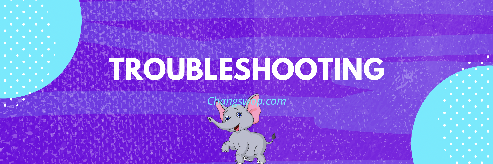

# แก้ไขข้อผิดพลาด

บางครั้งคุณอาจพบว่าตัวเองประสบปัญหาที่ไม่มีวิธีแก้ไขที่ชัดเจน เคล็ดลับการแก้ปัญหาเหล่านี้อาจช่วยคุณแก้ปัญหาที่คุณพบได้

## **ปัญหาการแลกเปลี่ยน**

### **ไม่เพียงพอ\_OUTPUT\_AMOUNT**

> ธุรกรรมไม่สำเร็จเนื่องจากข้อผิดพลาด: ChangRouter: INSUFFICIENT\_OUTPUT\_AMOUNT นี่อาจเป็นปัญหากับหนึ่งในโทเค็นที่คุณกำลังแลกเปลี่ยน
>
> ธุรกรรมไม่สำเร็จเนื่องจากข้อผิดพลาด: การคืนค่าการดำเนินการ: changrouter:ไม่เพียงพอ\_output\_amount

คุณกำลังพยายามสลับโทเค็น แต่ความทนทานต่อการเลื่อนหลุดต่ำเกินไปหรือสภาพคล่องต่ำเกินไป



1. รีเฟรชหน้าของคุณและลองอีกครั้งในภายหลัง
2. ลองซื้อขายในจำนวนที่น้อยลงในคราวเดียว
3. เพิ่มความทนทานต่อการเลื่อนหลุดของคุณ:
   1. แตะไอคอนการตั้งค่าในหน้าสภาพคล่อง
   2. เพิ่มความทนทานต่อการเลื่อนหลุดเล็กน้อยแล้วลองอีกครั้ง .png>)
4. สุดท้าย ลองใส่จำนวนที่มีทศนิยมน้อยลง



**สิ่งนี้มักจะเกิดขึ้นเมื่อทำการซื้อขายโทเค็นที่มีสภาพคล่องต่ำ**

นั่นหมายความว่ามีโทเค็นตัวใดตัวหนึ่งไม่เพียงพอที่คุณกำลังพยายามแลกเปลี่ยนใน Liquidity Pool: อาจเป็นโทเค็นขนาดเล็กที่มีคนซื้อขายเพียงไม่กี่คน

อย่างไรก็ตาม ยังมีโอกาสที่คุณกำลังพยายามแลกเปลี่ยนโทเค็นหลอกลวงที่ไม่สามารถขายได้ ในกรณีนี้ ChangSwap ไม่สามารถบล็อกโทเค็นหรือคืนเงินได้



### ** INSUFFICIENT\_A\_AMOUNT หรือ INSUFFICIENT\_B\_AMOUNT**

> ล้มเหลวโดยมีข้อผิดพลาด 'ChangRouter: INSUFFICIENT\_A\_AMOUNT'\
> หรือ\
> ล้มเหลวโดยมีข้อผิดพลาด 'ChangRouter: INSUFFICIENT\_B\_AMOUNT'

คุณกำลังพยายามเพิ่ม/ลบสภาพคล่องออกจากกลุ่มสภาพคล่อง (LP) แต่มีโทเค็นสองตัวในคู่ไม่เพียงพอ



**รีเฟรชเพจแล้วลองอีกครั้ง หรือลองอีกครั้งในภายหลัง**

ยังไม่ทำงาน?

1. แตะไอคอนการตั้งค่าในหน้าสภาพคล่อง
2. เพิ่มความทนทานต่อการเลื่อนหลุดเล็กน้อยแล้วลองอีกครั้ง

.png>)



ข้อผิดพลาดเกิดจากการพยายามเพิ่มหรือลบสภาพคล่องสำหรับกลุ่มสภาพคล่อง (LP) ที่มีโทเค็น A หรือโทเค็น B ไม่เพียงพอ (หนึ่งในโทเค็นในคู่เงิน)

อาจเป็นกรณีที่ราคาอัปเดตเร็วเกินไปเมื่อและค่าเผื่อการเลื่อนหลุดของคุณต่ำเกินไป

ebcf18765ade

1. เลือก **เขียนสัญญา** จากนั้นเลือก **เชื่อมต่อกับ Web3** และเชื่อมต่อกระเป๋าเงินของคุณ : ป้อนที่อยู่สัญญาของโทเค็น LP ที่คุณพยายามโต้ตอบด้วย
   2. ค่า (uint256): -1

**แบบสอบถาม "ยอดดุล"**

1. เปลี่ยนเป็น **อ่านสัญญา**
2. ใน **5. balanceOf** ป้อนที่อยู่กระเป๋าเงินของคุณแล้วกด **แบบสอบถาม**
3. ติดตามหมายเลขที่ส่งออก มันแสดงยอดเงินของคุณภายใน LP ในรูปแบบ uint256 ซึ่งคุณจะต้องใช้ในขั้นตอนถัดไป

.png>)

**เพิ่มหรือลบสภาพคล่อง**

ไปที่สัญญาเราเตอร์: [https://bkcscan.com/address/0x05ff2b0db69458a0750badebc4f9e13add608c7f#writeContract](https://bkcscan.com/address/0x05ff2b0db69458a0750badebc4f9e13addContract8c7f#writeContract8c7f)

1. เลือก **เขียนสัญญา** และ **เชื่อมต่อกับ Web3** ตามด้านบน
2. ค้นหา **addLiquidity** หรือ **removeLiquidity** (ไม่ว่าคุณจะพยายามทำอะไร)
3. ป้อนที่อยู่โทเค็นของทั้งสองโทเค็นใน LP
4. ใน **สภาพคล่อง (uint256)** ให้ป้อนหมายเลข uint256 ที่คุณได้รับจาก "balanceOf" ด้านบน
5. ตั้งค่า **amountAMin** หรือ **amountBMin** ให้ต่ำ: ลอง 1 สำหรับทั้งคู่
6. เพิ่มที่อยู่กระเป๋าสตางค์ของคุณใน **ถึง (ที่อยู่)**
7. กำหนดเวลาจะต้องเป็นช่วงเวลาที่มากกว่าเวลาที่ tx ถูกดำเนินการ

.png>)


ซึ่งอาจทำให้เกิดการคลาดเคลื่อนได้สูงมาก และอาจทำให้ผู้ใช้สูญเสียเงินทุนบางส่วนได้หากใช้แนวหน้า




### ChangRouter: หมดอายุ

> ธุรกรรมไม่สำเร็จเนื่องจากข้อผิดพลาด: ChangRouter: EXPIRED นี่อาจเป็นปัญหากับหนึ่งในโทเค็นที่คุณกำลังแลกเปลี่ยน

ลองอีกครั้ง แต่ยืนยัน (ลงชื่อและออกอากาศ) ธุรกรรมทันทีที่คุณสร้าง

สิ่งนี้เกิดขึ้นเนื่องจากคุณเริ่มทำธุรกรรม แต่คุณไม่ได้ลงนามและเผยแพร่จนกว่าจะพ้นกำหนด นั่นหมายความว่าคุณไม่ได้กด "ยืนยัน" เร็วพอ

### ช้าง: K

> ธุรกรรมไม่สำเร็จเนื่องจากข้อผิดพลาด: Chang: K. นี่อาจเป็นปัญหากับหนึ่งในโทเค็นที่คุณกำลังแลกเปลี่ยน

ลองแก้ไขจำนวนเงินในช่อง "ถึง" จึงใส่สัญลักษณ์ "(โดยประมาณ)" บน "จาก" จากนั้นเริ่มการแลกเปลี่ยนทันที

ซึ่งมักจะเกิดขึ้นเมื่อคุณพยายามสลับโทเค็นด้วยค่าธรรมเนียมของตัวเอง

### ช้าง: TRANSFER\_FAILED

> ธุรกรรมไม่สำเร็จเนื่องจากข้อผิดพลาด: การคืนค่าการดำเนินการ: ช้าง: TRANSFER\_FAILED

ตรวจสอบให้แน่ใจว่าคุณมีโทเค็นในกระเป๋าสตางค์ของคุณมากกว่า 30% หรือพยายามแลกเปลี่ยนในปริมาณที่น้อยกว่า หากคุณต้องการขายให้ได้มากที่สุด ลอง 70% หรือ 69% แทน 100%\
เกิดจากการออกแบบโทเค็น Restorative Rebase เช่น tDoge หรือ tBTC\
[ทำความเข้าใจวิธีการทำงานของโทเค็นการรีเบสแบบบูรณะ](https://btcst.medium.com/stp-8-restorative-rebase-b4fbbdfd96c)

สาเหตุที่เป็นไปได้อีกประการของปัญหานี้คือผู้ออกโทเค็นที่เป็นอันตรายเพิ่งระงับการซื้อขายโทเค็นของตน หรือพวกเขาทำการขายได้เฉพาะกับที่อยู่กระเป๋าเงินที่เลือกเท่านั้น โปรดทำวิจัยของคุณเองเสมอเพื่อหลีกเลี่ยงการฉ้อโกงที่อาจเกิดขึ้น หากโทเค็นที่คุณพยายามเปลี่ยนแต่ล้มเหลวด้วยรหัสข้อผิดพลาดนี้มาจาก airdrop นั่นอาจเป็นการหลอกลวง โปรดอย่าดำเนินการอนุมัติโทเค็นใดๆ หรือคลิกลิงก์ใดๆ กองทุนของคุณอาจมีความเสี่ยงหากคุณพยายามทำเช่นนั้น

### ธุรกรรมไม่สำเร็จ

ลองซื้อขายในจำนวนที่น้อยลงหรือเพิ่มความทนทานต่อการเลื่อนหลุดผ่านไอคอนการตั้งค่าแล้วลองอีกครั้ง เกิดจากสภาพคล่องต่ำ

### ** ราคาผลกระทบสูงเกินไป **

ลองซื้อขายในจำนวนที่น้อยลงหรือเพิ่มความทนทานต่อการเลื่อนหลุดผ่านไอคอนการตั้งค่าแล้วลองอีกครั้ง เกิดจากสภาพคล่องต่ำ

### การประมาณการแก๊สล้มเหลว

> ธุรกรรมนี้จะล้มเหลว โปรดติดต่อฝ่ายสนับสนุน



**หากคุณพบข้อผิดพลาดนี้ขณะลบสภาพคล่องออกจากคู่ KUB:**

โปรดเลือก "รับ WKUB" และลองอีกครั้ง

**หากคุณพบข้อผิดพลาดนี้ขณะพยายามสลับ:**

โปรดติดต่อทีมงานโปรเจ็กต์ของโทเค็นที่คุณพยายามแลกเปลี่ยน \*\*\*\* ปัญหานี้ต้องได้รับการแก้ไขโดยทีมงานโครงการ



**ปัญหานี้ (ขณะทำการสลับ) เกิดจากโทเค็นที่มีการฮาร์ดโค้ดเราเตอร์ V1 ChangSwap ในสัญญา**

แม้ว่าแนวทางปฏิบัตินี้จะไม่ได้รับการแนะนำอย่างดีที่สุด เหตุผลสำหรับโครงการเหล่านี้ที่ทำเช่นนี้ดูเหมือนจะเป็นเพราะโทคีโนมิกส์ ซึ่งการซื้อแต่ละครั้งจะส่ง % ของโทเค็นไปยัง LP

โปรเจ็กต์ที่ได้รับผลกระทบจะไม่ทำงานกับเราเตอร์ V2: พวกเขามักจะต้องสร้างโทเค็นเวอร์ชันใหม่ที่ชี้ไปยังที่อยู่เราเตอร์ใหม่ของเรา และย้ายผู้ถือโทเค็นที่มีอยู่ไปยังโทเค็นใหม่

เราขอแนะนำว่าโครงการใดๆ ที่สร้างโทเค็นดังกล่าวควรพยายามป้องกันไม่ให้ผู้ใช้เพิ่มลงใน V2 LP

ที่อยู่เราเตอร์ที่เป็นปัจจุบันคือ [https://bkcscan.com/address/0x10ED43C718714eb63d5aA57B78B54704E256024E](https://bkcscan.com/address/0x10ED43C718714eb63d5aA57B78B54704E256024E)



### ไม่สามารถอ่านคุณสมบัติ 'toHexString' ของ undefined

> "ข้อผิดพลาดที่ไม่รู้จัก: "ไม่สามารถอ่านคุณสมบัติ 'toHexString' ของ undefined"

เมื่อพยายามสลับโทเค็น ธุรกรรมจะล้มเหลวและข้อความแสดงข้อผิดพลาดนี้จะปรากฏขึ้น มีการรายงานข้อผิดพลาดนี้บนอุปกรณ์มือถือโดยใช้ Trust Wallet



1. ลองทำรายการอีกครั้งโดยมีค่าเผื่อการคลาดเคลื่อนเพิ่มขึ้น
2. หาก 1. ไม่สามารถแก้ไขปัญหาของคุณได้ ให้พิจารณาใช้กระเป๋าเงินอื่น เช่น SafePal สำหรับการทำธุรกรรมของคุณ



**สิ่งนี้มักเกิดขึ้นเมื่อทำการซื้อขายโทเค็นโดยมีค่าเผื่อการเลื่อนหลุดไม่เพียงพอใน Trust Wallet**

รายละเอียดที่แน่นอนของปัญหายังอยู่ในระหว่างการตรวจสอบ



### **กลับการดำเนินการ: TransferHelper: TRANSFER\_FROM\_FAILED**

> ธุรกรรมไม่สำเร็จเนื่องจากข้อผิดพลาด: การดำเนินการถูกเปลี่ยนกลับ: TransferHelper: TRANSFER\_FROM\_FAILED

เมื่อพยายามสลับโทเค็น ธุรกรรมจะล้มเหลวและข้อความแสดงข้อผิดพลาดนี้จะปรากฏขึ้น มีการรายงานข้อผิดพลาดนี้ในแพลตฟอร์มต่างๆ



1. ตรวจสอบให้แน่ใจว่าคุณมีเงินเพียงพอ
2. ตรวจสอบให้แน่ใจว่าคุณได้ให้สัญญาอนุญาตเพื่อใช้จ่ายเงินที่คุณพยายามจะซื้อขายด้วย



ข้อผิดพลาดนี้เกิดขึ้นเมื่อทำการซื้อขายโทเค็นโดยมีค่าเผื่อไม่เพียงพอ หรือเมื่อกระเป๋าเงินมีเงินไม่เพียงพอ\
หากคุณกำลังซื้อขายโทเค็นด้วย Restorative Rebase เช่น tau asset tDoge หรือ tBTC อย่าลืมทำความเข้าใจวิธีการทำงานก่อนด้วย [คำแนะนำเกี่ยวกับ Rebase tokens](https://btcst.medium.com/stp-8-restorative-rebase -b4fbbdfd96c)



## **ปัญหาเกี่ยวกับโรงเบียร์**

### KEP20: ปริมาณการเบิร์นเกินสมดุล

> ล้มเหลวโดยมีข้อผิดพลาด 'KEP20: จำนวนการเบิร์นเกินยอดคงเหลือ'

คุณมีน้ำเชื่อมในกระเป๋าไม่เพียงพอที่จะถอนออกจากสระช้างช้าง

**รับน้ำเชื่อมอย่างน้อยเท่ากับจำนวนช้างที่คุณพยายามจะเลิกดื่ม**

1. ซื้อน้ำเชื่อมจากการแลกเปลี่ยน ถ้าคุณต้องการยกเลิก 100 CHANG คุณต้องมีอย่างน้อย 100 SYRUP
2. ลองแกะใหม่อีกครั้ง

หากยังคงล้มเหลว คุณสามารถดำเนินการ “ถอนเงินฉุกเฉิน” จากสัญญาได้โดยตรงเพื่อปลดโทเค็นที่เดิมพันของคุณ

1. ไปที่: [https://bkcscan.com/address/0x73feaa1eE314F8c655E354234017bE2193C9E24E#writeContract](https://bkcscan.com/address/0x73feaa1eE314F8c655E354234017bE2193C9E24E)
2. คลิก **“เชื่อมต่อกับ Web3”** และเชื่อมต่อกระเป๋าเงินของคุณ  ดังนั้นหากคุณไม่มีเพียงพอ คุณจะไม่สามารถถอดออกจากสระได้


src="https://lh4.googleusercontent.com/KchAcnM6cpX2BotEGppAxPAnY4Xbona6yI6ZWg9FlUUBfPi_YO9ulM1s6htXJVXMzEwl0Uxcvdk8o4yhI7ar5g0TRpLVFjkS4YLKL7FS8Z4uFqeC37sw-TIkrPr7BCZQVpuD-5jO" alt="" data-size="original">


### แก๊สหมดข้อผิดพลาด

> คำเตือน! พบข้อผิดพลาดระหว่างการดำเนินการตามสัญญา \[น้ำมันหมด]

คุณได้ตั้งค่าขีดจำกัดก๊าซต่ำเมื่อพยายามทำธุรกรรม



ลองเพิ่ม **ขีดจำกัดก๊าซ** (ไม่ใช่ราคาน้ำมัน!) ในกระเป๋าเงินของคุณด้วยตนเองก่อนลงนามในการทำธุรกรรม

โดยปกติวงเงิน 200,000 ก็เพียงพอแล้ว

.png>)

ตัวอย่างข้างต้นมาจาก Metamask; ตรวจสอบเอกสารในกระเป๋าเงินของคุณ หากคุณไม่แน่ใจว่าจะปรับขีดจำกัดน้ำมันอย่างไร



โดยทั่วไป กระเป๋าเงินของคุณ (Metamask, Trust Wallet เป็นต้น) ไม่สามารถทำสิ่งที่พยายามทำจนเสร็จได้

กระเป๋าเงินของคุณประมาณการว่าขีดจำกัดของน้ำมันนั้นต่ำเกินไป ดังนั้นการเรียกใช้ฟังก์ชันจะหมดน้ำมันก่อนที่การเรียกใช้ฟังก์ชันจะเสร็จสิ้น



### KEP20: จำนวนเงินที่โอนเกินที่อนุญาต

> ล้มเหลวโดยมีข้อผิดพลาด 'KEP20: ยอดโอนเกินค่าเผื่อ'


1. ใช้ Unrekt.net เพื่อเพิกถอนการอนุมัติสำหรับสัญญาอัจฉริยะที่คุณพยายามโต้ตอบด้วย
2. อนุมัติสัญญาอีกครั้งโดยไม่กำหนดวงเงินค่าเผื่อการใช้จ่าย
3. ลองโต้ตอบกับสัญญาอีกครั้ง



สิ่งนี้จะเกิดขึ้นเมื่อคุณกำหนดขีดจำกัดการใช้จ่ายของคุณเมื่อคุณอนุมัติสัญญาในครั้งแรก จากนั้นพยายามเปลี่ยนให้มากกว่าขีดจำกัด



### KEP20: ยอดโอนเกินยอด

> ล้มเหลวโดยมีข้อผิดพลาด 'KEP20: จำนวนเงินที่โอนเกินยอดคงเหลือ'

คุณอาจกำลังพยายามแยกส่วนจากโรงเบียร์ที่มีรางวัลต่ำอยู่ในนั้น วิธีแก้ปัญหาด้านล่าง

หากไม่เป็นเช่นนั้น คุณอาจกำลังพยายามส่งโทเค็นที่คุณไม่มีในกระเป๋าเงินของคุณ (เช่น พยายามส่งโทเค็นที่กำหนดให้กับธุรกรรมที่รอดำเนินการ) ในกรณีนี้ ตรวจสอบให้แน่ใจว่าคุณมีโทเค็นที่คุณต้องการใช้



ประการแรก [ แจ้งให้ทีมทราบ](../contact-us/telegram.md) ว่าคุณพยายามจะปลดล็อกพูลใด เพื่อให้พวกเขาสามารถเติมเงินรางวัลได้ หากคุณกำลังรีบที่จะยกเลิกการเดิมพันและคุณไม่รังเกียจที่จะสูญเสียผลตอบแทนที่รอดำเนินการ ให้ลองใช้กรณีฉุกเฉินถอน:

คุณสามารถดำเนินการ “ถอนเงินฉุกเฉิน” จากสัญญาได้โดยตรงเพื่อถอนโทเค็นที่เดิมพันของคุณ

1. ค้นหาที่อยู่สัญญาของ Brewery Pool ที่คุณพยายามจะถอนออก คุณสามารถค้นหาได้ในบันทึกการทำธุรกรรมของกระเป๋าเงินของคุณ
2. ไปที่ [https://bkcscan.com/](https://bkcscan.com/address/0x73feaa1eE314F8c655E354234017bE2193C9E24E#writeContract) และในแถบค้นหา ให้ป้อนที่อยู่ของสัญญา
3. เลือก **เขียนสัญญา**
4. คลิก **“เชื่อมต่อกับ Web3”** และเชื่อมต่อกระเป๋าเงินของคุณ
5. ในส่วน **“3. ถอนฉุกเฉิน”,** และคลิก “เขียน”

สิ่งนี้จะ unstake โทเค็นที่เดิมพันของคุณและสูญเสียผลตอบแทนที่ยังไม่ได้รวบรวม


**สิ่งนี้จะสูญเสียผลผลิตที่คุณยังไม่ได้เก็บเกี่ยว**




ข้อผิดพลาดนี้มักจะปรากฏขึ้นเมื่อคุณพยายามจะดึงออกจาก Brewery Pool เก่า แต่มีรางวัลไม่เพียงพอในพูลที่เหลือให้คุณเก็บเกี่ยวเมื่อถอนตัว ทำให้ธุรกรรมล้มเหลว



## **ปัญหากับการทำนาย**

ตรวจสอบ [broken-reference](broken-reference/ "กล่าวถึง")

## **ปัญหาอื่นๆ**

### ข้อผิดพลาดของผู้ให้บริการ

> ข้อผิดพลาดของผู้ให้บริการ\
> ไม่พบผู้ให้บริการ

สิ่งนี้จะเกิดขึ้นเมื่อคุณพยายามเชื่อมต่อผ่านส่วนขยายของเบราว์เซอร์ เช่น MetaMask หรือ Bitkub chain Wallet แต่คุณยังไม่ได้ติดตั้งส่วนขยาย



ติดตั้งส่วนขยายเบราว์เซอร์อย่างเป็นทางการเพื่อเชื่อมต่อ หรืออ่านคำแนะนำของเราเกี่ยวกับ [วิธีเชื่อมต่อกระเป๋าเงินกับ ChangSwap](https://docs.changswap.com/get-started/connection-guide)



### รหัสลูกโซ่ที่ไม่รองรับ

เปลี่ยนเชนของคุณเป็น Bitkub Chain ตรวจสอบเอกสารกระเป๋าเงินของคุณเพื่อดูคำแนะนำหากคุณต้องการความช่วยเหลือ

### กำลังประมวลผล eth\_requestAccounts แล้ว โปรดรอ.

ตรวจสอบให้แน่ใจว่าคุณได้ลงชื่อเข้าใช้แอปกระเป๋าเงินและเชื่อมต่อกับ Bitkub Chain แล้ว

### ปัญหาในการซื้อ SAFEMOON และโทเค็นที่คล้ายกัน

ในการเทรด SAFEMOON คุณต้องคลิกที่ไอคอนการตั้งค่าและ **ตั้งค่าเผื่อ Slippage ของคุณเป็น 12% หรือมากกว่า**\
ทั้งนี้เป็นเพราะ **SafeMoon เรียกเก็บค่าธรรมเนียม 10% สำหรับแต่ละธุรกรรม**:

* ค่าธรรมเนียม 5% = แจกจ่ายให้กับผู้ถือที่มีอยู่ทั้งหมด
* ค่าธรรมเนียม 5% = ใช้เพื่อเพิ่มสภาพคล่อง

นี่เป็นสาเหตุที่คุณอาจไม่ได้รับโทเค็นมากเท่าที่ควรเมื่อคุณซื้อ\
อ่านเพิ่มเติมเกี่ยวกับ [วิธีซื้อ Safe Moon](https://community.trustwallet.com/t/how-to-buy-safemoon/155742)

### ข้อผิดพลาด JSON-RPC ภายใน

> "MetaMask - ข้อผิดพลาด RPC: ข้อผิดพลาด JSON-RPC ภายใน การประมาณการแก๊สล้มเหลวในการลบLiquidityETHWithPermitSupportingFeeOnTransferTokens การประมาณการGas ล้มเหลว removeLiquidityETHWithPermit "

เกิดขึ้นเมื่อพยายามลบสภาพคล่องของโทเค็นบางตัวผ่าน Metamask ยังไม่ทราบสาเหตุที่แท้จริง ลองใช้กระเป๋าเงินอื่น

> ข้อผิดพลาด JSON-RPC ภายใน { "code": -32000, "message": "ไม่เพียงพอสำหรับการโอน" } - โปรดลองอีกครั้ง

คุณมี KUB ไม่เพียงพอที่จะชำระค่าธรรมเนียมการทำธุรกรรม คุณต้องการ KEP-20 เครือข่าย KUB เพิ่มเติมในกระเป๋าเงินของคุณ

### ข้อผิดพลาด: \[ethjs-query]

> ข้อผิดพลาด: "[ethjs-query] ขณะจัดรูปแบบเอาต์พุตจาก RPC '{"value":{"code":-32603,"data":{"code":-32000,"message":"transaction underpriced"\} }}"

เพิ่มขีด จำกัด ก๊าซสำหรับการทำธุรกรรมในกระเป๋าเงินของคุณ ตรวจสอบเอกสารในกระเป๋าเงินของคุณเพื่อเรียนรู้วิธีเพิ่มขีดจำกัดน้ำมัน

> การสลับล้มเหลว: ข้อผิดพลาด: \[ethjs-query] ขณะจัดรูปแบบเอาต์พุตจาก RPC '{"value":{"code":-32603,"data":{"code":-32603,"message":"จัดการคำขอ ข้อผิดพลาด"\}}}'

สาเหตุไม่ชัดเจน ลองทำตามขั้นตอนเหล่านี้ก่อนลองอีกครั้ง:

1. เพิ่มขีดจำกัดแก๊ส
2. เพิ่มการเลื่อนหลุด
3. ล้างแคช

## **ปัญหาเกี่ยวกับโปรไฟล์**

### อ๊ะ! เราไม่พบช้างของสะสมในกระเป๋าเงินของคุณ

เรากำลังตรวจสอบเหตุผลเบื้องหลังปัญหานี้ ในระหว่างนี้โปรดลองวิธีแก้ปัญหา



1. ไปที่หน้า “สะสม” แล้วกลับมาที่หน้าโปรไฟล์\
   หากไม่พบลิงก์ ให้ไปที่ [https://changswap.com/collectibles](https://changswap.com/collectibles) โดยตรง
2. ลองสร้างโปรไฟล์อีกครั้ง



เปลี่ยนสิ่งแวดล้อม

* ล้างแคชและลองอีกครั้ง
* ลองอีกครั้งในเบราว์เซอร์อื่น
* ลองใหม่อีกครั้งในแอปกระเป๋าเงินต่างๆ
* ลองอีกครั้งในเครือข่ายอื่น (สลับระหว่าง Wi-Fi และเซลลูลาร์)



### การตรวจสอบชื่อผู้ใช้ยังคงหมุนอยู่

มีสองสาเหตุที่เป็นไปได้

1. คุณมีกระเป๋าเงินหลายใบติดตั้งอยู่บนเบราว์เซอร์
2. ปัญหาเครือข่าย



สาเหตุ: คุณมีกระเป๋าเงินหลายใบติดตั้งอยู่บนเบราว์เซอร์\
\
มันอาจทำให้เกิดความขัดแย้งระหว่างกระเป๋าเงิน สิ่งนี้อยู่เหนือการควบคุมของ ChangSwap และเราไม่สามารถทำอะไรได้

1. ติดตั้งกระเป๋าเงินเดียวบนเบราว์เซอร์ ลบอื่น ๆ
2. เชื่อมต่อกระเป๋าเงินอีกครั้งแล้วลองตั้งค่าชื่อผู้ใช้อีกครั้ง



สาเหตุ: เครือข่ายไม่เสถียร

คุณต้องลองอีกครั้ง

1. ลบสิ่งที่ป้อนลงในช่องข้อความทั้งหมด
2. พิมพ์ชื่อผู้ใช้อีกครั้ง จากนั้นโปรดรอสักครู่
3. หากไม่ได้ผล ให้โหลดหน้าใหม่และลองอีกครั้ง

