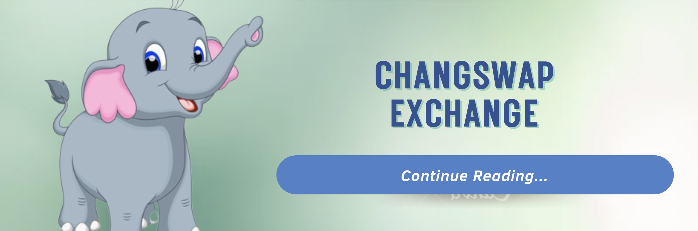

# 🔄 แลกเปลี่ยน

ChangSwap คือผู้สร้างตลาดอัตโนมัติ (AMM) และการแลกเปลี่ยนคือหัวใจของ ChangSwap ChangSwap เป็น AMM ชั้นนำใน Bitkub Chain และตามสถิติแล้ว Decentralized Exchange (DEX) ที่ได้รับความนิยมมากที่สุดตลอดกาล!

ChangSwap Exchange มีคุณสมบัติหลายอย่างที่สนับสนุนการซื้อขายแบบกระจายอำนาจ:

### การแลกเปลี่ยน/การซื้อขาย

ChangSwap ให้ผู้ใช้ซื้อขายโดยไม่ต้องผ่าน Centralized Exchange ทุกสิ่งที่คุณทำบน ChangSwap จะถูกส่งโดยตรงผ่านกระเป๋าเงินของคุณ ไม่จำเป็นต้องไว้ใจคนอื่นด้วยเหรียญของคุณ!

### สระสภาพคล่อง

คุณสามารถสลับโทเค็นบน ChangSwap ได้หากมีสภาพคล่องเพียงพอสำหรับโทเค็นเหล่านั้น หากไม่มีใครเพิ่มสภาพคล่องให้กับโทเค็นหรือโทเค็นที่คุณต้องการแลกเปลี่ยนมากนัก มันจะทำได้ยาก มีราคาแพง หรือเป็นไปไม่ได้เลย

การให้สภาพคล่องจะทำให้คุณได้รับ LP Token ซึ่งจะทำให้คุณได้รับผลตอบแทนในรูปแบบของค่าธรรมเนียมการซื้อขายเพื่อให้แน่ใจว่ามีสภาพคล่องอยู่เสมอสำหรับการแลกเปลี่ยนที่จะใช้

### ผลผลิตทางการเกษตร

การทำฟาร์มผลตอบแทนให้ผู้ใช้ที่ให้สภาพคล่องได้รับรางวัล CHANG โดยการล็อคโทเค็น LP ของพวกเขาไว้ในสัญญาอัจฉริยะ

### ข้อเสนอฟาร์มเริ่มต้น (IFO)

Initial Farm Offer เป็นกิจกรรมที่ให้ผู้ใช้ซื้อในข้อเสนอแบบจำกัดเวลาเพื่อซื้อโทเค็นใหม่ ราคา IFO มักจะใจกว้างมาก