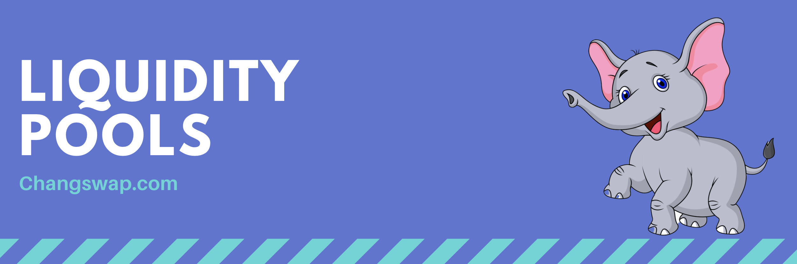

# สระสภาพคล่อง

เมื่อคุณเพิ่มโทเค็นของคุณใน Liquidity Pool คุณจะได้รับโทเค็น Liquidity Provider (LP) และแบ่งปันค่าธรรมเนียม

## LP Tokens

ตัวอย่างเช่น หากคุณฝาก **CHANG** และ **KUB** ลงใน Liquidity Pool คุณจะได้รับโทเค็น **CHANG-KUB LP**

จำนวนโทเค็น LP ที่คุณได้รับแสดงถึงส่วนของคุณในกลุ่มสภาพคล่องของ CHANG-KUB

คุณยังสามารถแลกเงินของคุณได้ทุกเมื่อโดยลบสภาพคล่องของคุณออก

## ผู้ให้บริการสภาพคล่องได้รับค่าธรรมเนียมการซื้อขาย

การจัดหาสภาพคล่องให้รางวัลแก่คุณในรูปแบบของค่าธรรมเนียมการซื้อขายเมื่อมีผู้คนใช้กลุ่มสภาพคล่องของคุณ

เมื่อใดก็ตามที่มีคนทำการซื้อขายบน ChangSwap ผู้ซื้อขายจะจ่ายค่าธรรมเนียม 0.25% **ซึ่ง 0.17%** จะถูกเพิ่มไปยังกลุ่มสภาพคล่องของคู่สวอปที่พวกเขาซื้อขาย

ตัวอย่างเช่น:

* มีโทเค็น LP 10 อัน แทนโทเค็น 10 CHANG และ 10 KUB
* 1 LP token = 1 CHANG + 1 KUB
* มีคนแลกเปลี่ยน 10 CHANG สำหรับ 10 KUB
* คนอื่นแลก 10 KUB เป็น 10 CHANG
* สระสภาพคล่อง CHANG/KUB ตอนนี้มี 10.017 CHANG และ 10.017 KUB
* โทเค็น LP แต่ละรายการมีมูลค่า 1.00017 CHANG + 1.00017 KUB

เพื่อให้การเป็นผู้ให้บริการสภาพคล่องคุ้มค่ายิ่งขึ้นในขณะที่คุณยังสามารถนำโทเค็น LP ของคุณไปใช้เพื่อเพิ่มผลตอบแทนใน [CHANG Farms](https://changswap.com/farms/) ในขณะที่ยังคงได้รับ 0.17 % ผลตอบแทนค่าธรรมเนียมการซื้อขาย

## การสูญเสียชั่วคราว

การจัดหาสภาพคล่องนั้นไม่ได้ปราศจากความเสี่ยง เนื่องจากคุณอาจประสบกับการสูญเสียอย่างไม่ถาวร

\
["พูดง่ายๆ ว่าการสูญเสียที่ไม่ถาวรคือความแตกต่างระหว่างการถือโทเค็นใน AMM และการถือไว้ในกระเป๋าเงินของคุณ" - เนท ฮินด์แมน](https://blog.bancor.network/beginners-guide-to-getting-rekt-by-impermanent-loss-7c9510cb2f22)