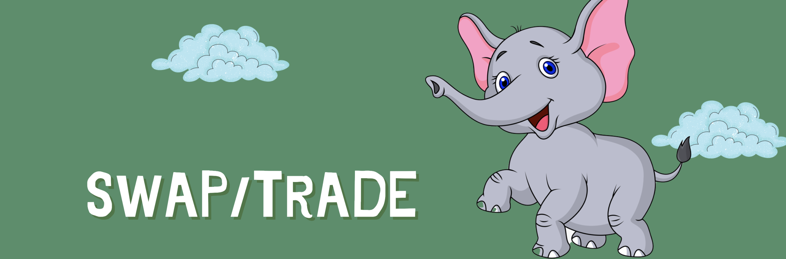

# การแลกเปลี่ยนโทเค็น

\*\*\*\*[**Token swaps**](https://changswap.com) บน ChangSwap เป็นวิธีง่ายๆ ในการแลกเปลี่ยน KEP-20 token กับอีกอันหนึ่งผ่านกลุ่มสภาพคล่องอัตโนมัติ

เมื่อคุณทำการแลกเปลี่ยนโทเค็น (การค้า) บนการแลกเปลี่ยน คุณจะต้องจ่าย **ค่าธรรมเนียมการซื้อขาย 0.25%** ซึ่งแบ่งออกเป็นดังนี้:

**0.17%** - กลับสู่ Liquidity Pool ในรูปแบบของรางวัลค่าธรรมเนียมสำหรับผู้ให้บริการสภาพคล่อง

**0.03%** - ส่งไปที่คลัง ChangSwap

**0.05%** - ส่งให้ CHANG ซื้อคืนและเบิร์น